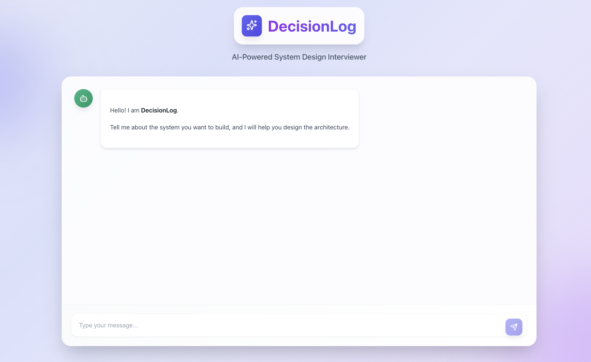
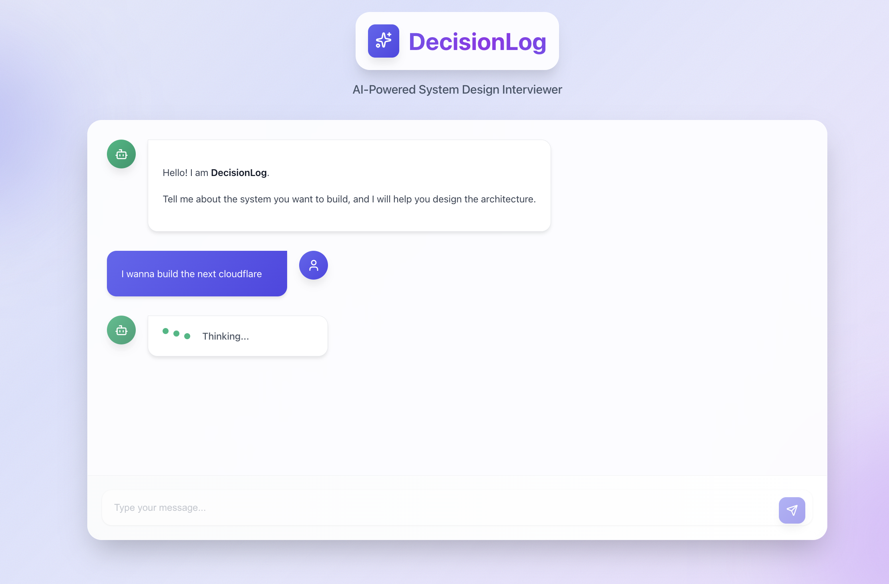
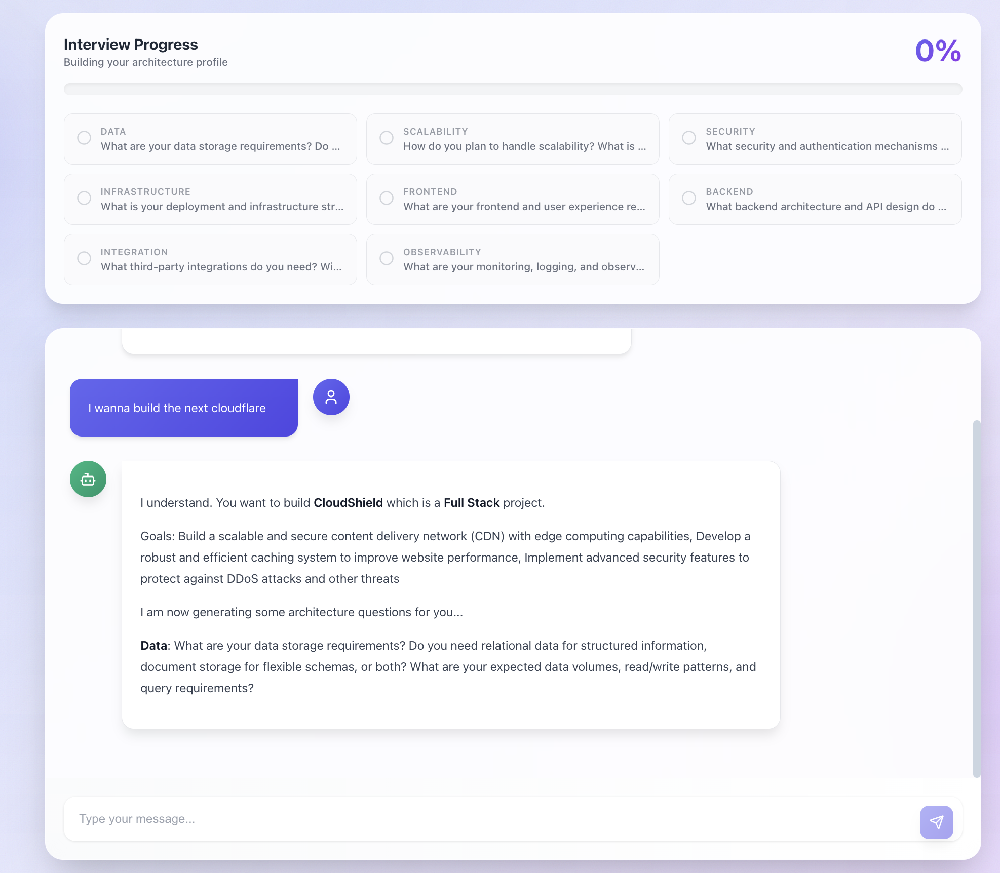
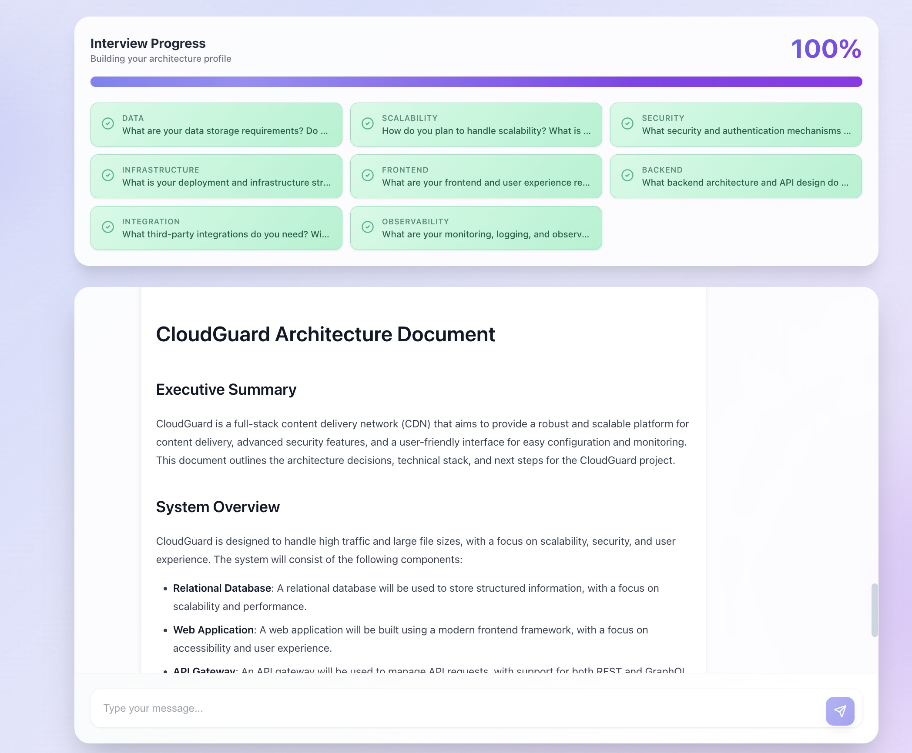

# DecisionLog

DecisionLog is an AI-powered system design interviewer that helps developers brainstorm and design system architectures. The application guides users through an interview process, gathering essential architectural details, and generates a comprehensive architecture document.

## Screenshots

### Initial Screen


### Ask about anything you want to build


### DecisionLog will ask you some questions about your project


### An architecture doc will be generated for you


## Prerequisites

- Node.js (v18 or higher)
- npm (comes with Node.js)
- Cloudflare account with Workers AI access

## Project Structure

```
cf_ai_decision_log/
├── backend/          # Cloudflare Workers backend
├── frontend/         # React frontend
├── screenshots/      # UI screenshots
└── README.md        # This file
```

## Setup

### Backend Setup

1. Navigate to the backend directory:
```bash
cd backend
```

2. Install dependencies:
```bash
npm install
```

3. Configure Cloudflare Workers:
   - Ensure you have a `wrangler.toml` file configured
   - Make sure your Cloudflare account has Workers AI enabled
   - The backend uses `@cf/meta/llama-3-8b-instruct` model

### Frontend Setup

1. Navigate to the frontend directory:
```bash
cd frontend
```

2. Install dependencies:
```bash
npm install
```

## Running the Application

### Start the Backend

1. Open a terminal and navigate to the backend directory:
```bash
cd backend
```

2. Start the development server:
```bash
npm run dev
```

The backend will start on `http://localhost:8787`

### Start the Frontend

1. Open a new terminal and navigate to the frontend directory:
```bash
cd frontend
```

2. Start the development server:
```bash
npm run dev
```

The frontend will start on `http://localhost:5173` (or another port if 5173 is occupied)

### Access the Application

Open your browser and navigate to:
```
http://localhost:5173
```

## How It Works

1. **Intent Phase**: User describes the system they want to build
2. **Question Planning**: The system generates 8-12 detailed architecture questions
3. **Interview Phase**: User answers questions one by one
4. **Confirmation Phase**: User can add additional information or proceed
5. **Synthesis Phase**: System generates a comprehensive architecture document

## Development

### Backend Scripts

- `npm run dev` - Start development server
- `npm run deploy` - Deploy to Cloudflare Workers
- `npm start` - Alias for `npm run dev`

### Frontend Scripts

- `npm run dev` - Start development server
- `npm run build` - Build for production
- `npm run preview` - Preview production build
- `npm run lint` - Run ESLint

## Configuration

### Backend Configuration

The backend requires:
- Cloudflare Workers AI binding configured in `wrangler.toml`
- Durable Objects namespace for session management

### Frontend Configuration

The frontend connects to the backend at `http://localhost:8787` by default. This is configured in `src/App.tsx`.
